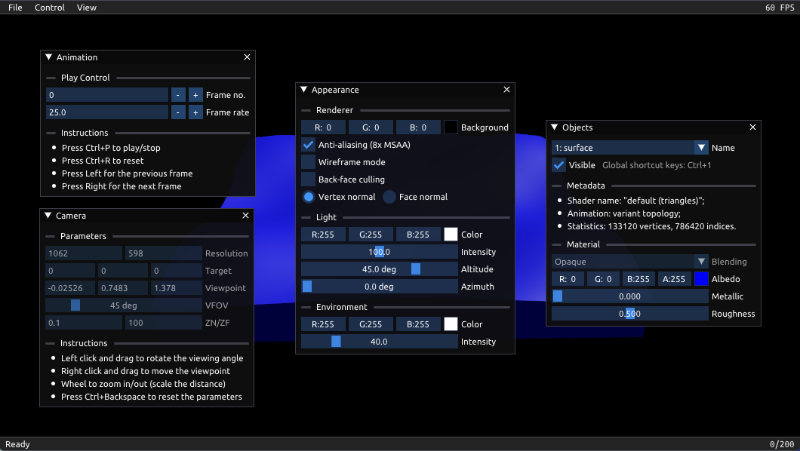
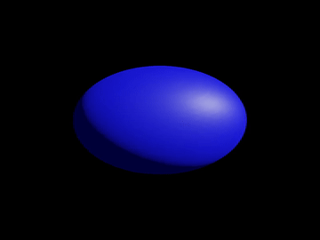
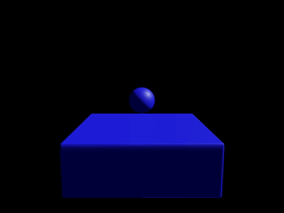

<div align="center">

# SimViewer

Desktop visualization and export tooling for simulation outputs.

Built for research workflows that need inspection, validation, and presentation of time-varying results without coupling the viewer to the simulation code itself.

[Preview](#preview) • [Highlights](#highlights) • [Quick Start](#quick-start) • [Data Format](docs/data-format.md) • [Docs](docs/README.md)

</div>

## Preview



Animation previews:

| Clip 1 | Clip 2 |
| --- | --- |
|  |  |

The README uses GIF previews for stable inline rendering on GitHub.

## Overview

SimViewer is a modern C++ and OpenGL desktop application for browsing animated simulation results in 2D and 3D. It is designed as a research tool: load a result directory, inspect scene objects, step through frames, tune appearance parameters, and export screenshots, meshes, or MP4 videos for debugging, evaluation, papers, and demos.

The repository is intentionally split into two layers:

- `engine/` contains reusable application, rendering, GUI, and utility code
- `viewer/` contains simulation-specific loading, object handling, viewer panels, and export workflows

SimViewer is not a simulation framework, solver, or benchmark suite. It is the viewing and presentation layer around simulation data.

## Highlights

- Interactive 2D and 3D visualization for time-varying simulation scenes
- Frame-by-frame playback with asynchronous background loading
- Per-object visibility, material, and shading controls
- Screenshot capture from the current viewport
- Mesh export for the current frame or all loaded frames
- MP4 animation export through `ffmpeg`
- Lightweight desktop UI built with ImGui

## Quick Start

### Requirements

- a C++ compiler with modern C++ support
- OpenGL support on the target machine
- [xmake](https://xmake.io/)
- `ffmpeg` for MP4 export

Third-party dependencies are resolved through xmake packages:

- `cxxopts`
- `eigen`
- `glad`
- `glfw`
- `glm`
- `imgui`
- `nativefiledialog-extended`
- `spdlog`
- `stb`
- `tinyply`
- `yaml-cpp`

### Build

```bash
xmake f -m release
xmake
```

### Run

```bash
xmake run viewer -- --dirname path/to/simulation_output
```

If no directory is provided, the application defaults to `output`.

## Usage

SimViewer opens a directory-based dataset and exposes viewer controls through the menu bar, side panels, mouse interaction, and keyboard shortcuts.

Keyboard shortcuts:

- `Left` / `Right`: step frames while playback is paused
- `Ctrl+P`: play or stop animation
- `Ctrl+R`: reset animation state
- `Ctrl+S`: save screenshot
- `Ctrl+N`: export animation
- `Ctrl+M`: export models
- `Ctrl+Backspace`: reset camera

Mouse interaction:

- 3D mode: left drag rotates, right drag translates, mouse wheel zooms
- 2D mode: right drag pans, mouse wheel zooms

Main panels:

- Animation: frame navigation and playback settings
- Appearance: background, shading, lighting, and renderer options
- Camera: current view parameters and interaction hints
- Objects: visibility, metadata, and material controls for each object

## Data Format

The dataset contract lives in [docs/data-format.md](docs/data-format.md).

That document covers:

- directory layout
- `description.yaml` schema
- object metadata fields
- supported public binary payload layouts
- frame semantics and naming rules

## Export Workflows

### Screenshots

Use `Ctrl+S` or `File > Save Screenshot` to save the current viewport as an image.

### Models

Use `Ctrl+M` or `File > Export > Models` to export selected objects from the current frame or all loaded frames.

### MP4 Animation

Use `Ctrl+N` or `File > Export > Animation` to export an MP4.

SimViewer searches for `ffmpeg` in either of these locations:

- on your system `PATH`
- as `ffmpeg.exe` next to the viewer executable

## Repository Layout

- `engine/`: core application, input, windowing, rendering, shader, GUI, and utility code
- `viewer/`: dataset loading, scene objects, viewer UI, and export logic
- `assets/`: built-in shaders and fonts copied next to the executable during the build
- `docs/`: public-facing documentation and GitHub media assets
- `xmake.lua`: build configuration and dependencies

## Development Notes

- Dependencies are declared in `xmake.lua` and resolved through xmake packages.
- Assets under `assets/` are copied into the output directory automatically.
- The viewer assumes a directory-based dataset with `description.yaml` plus per-frame binary files.

## Contributing

Issues and pull requests are welcome. If you want to contribute a new data layout, renderer feature, or export path, opening an issue first will help keep the viewer contract clear and avoid accidental format drift.

## License

This project is licensed under the MIT License. See [LICENSE](LICENSE) for details.
